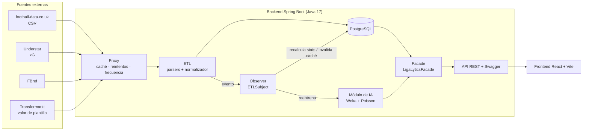
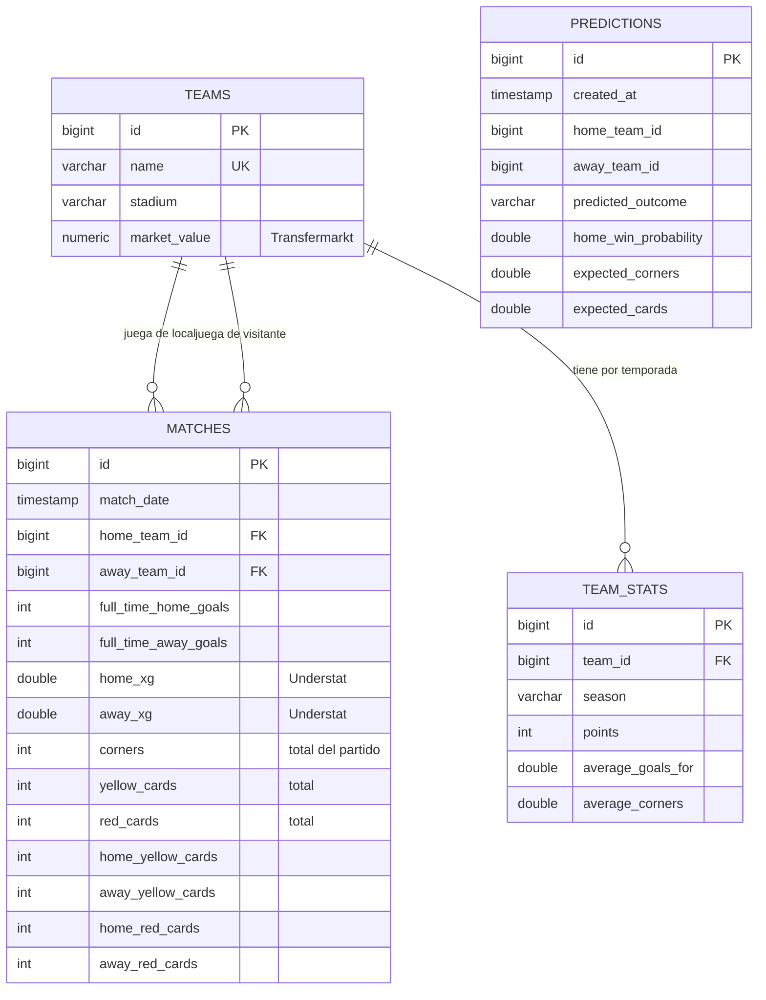
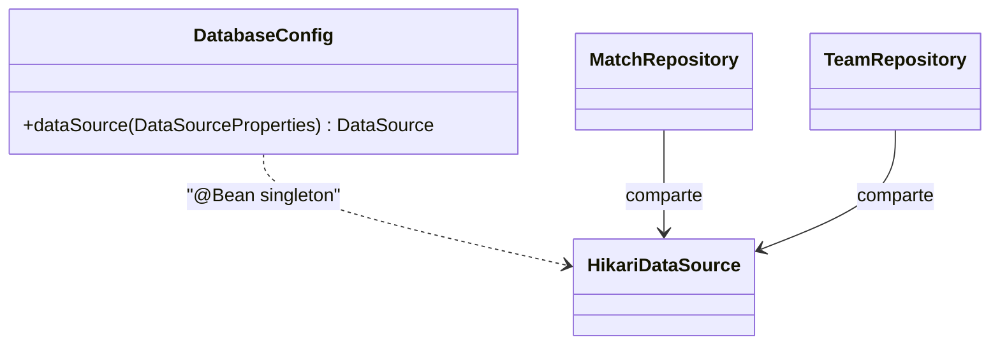
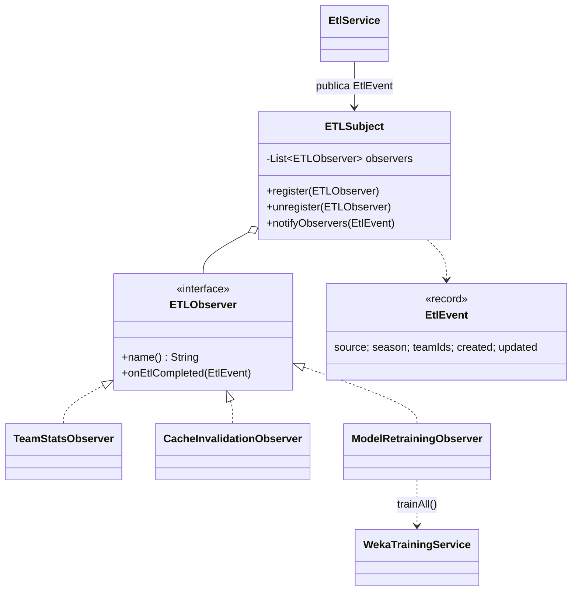
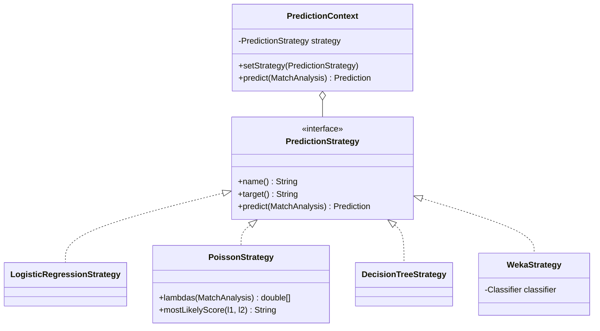
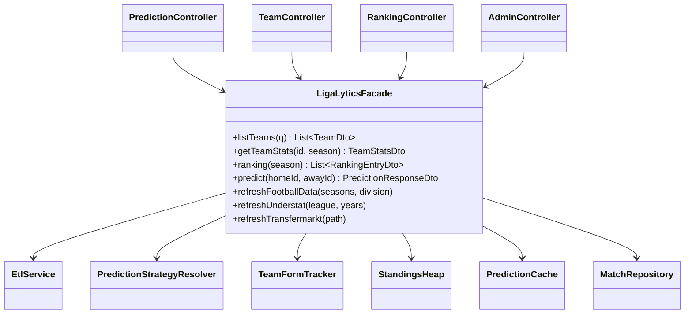
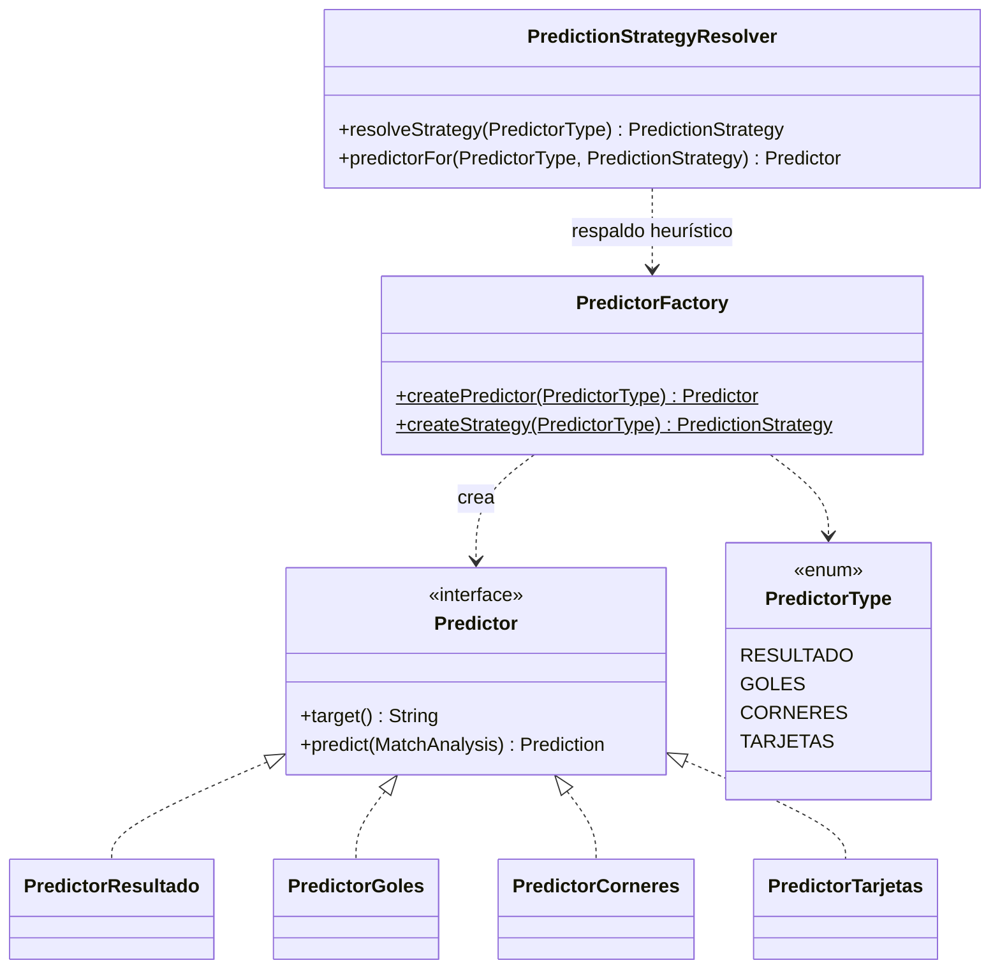
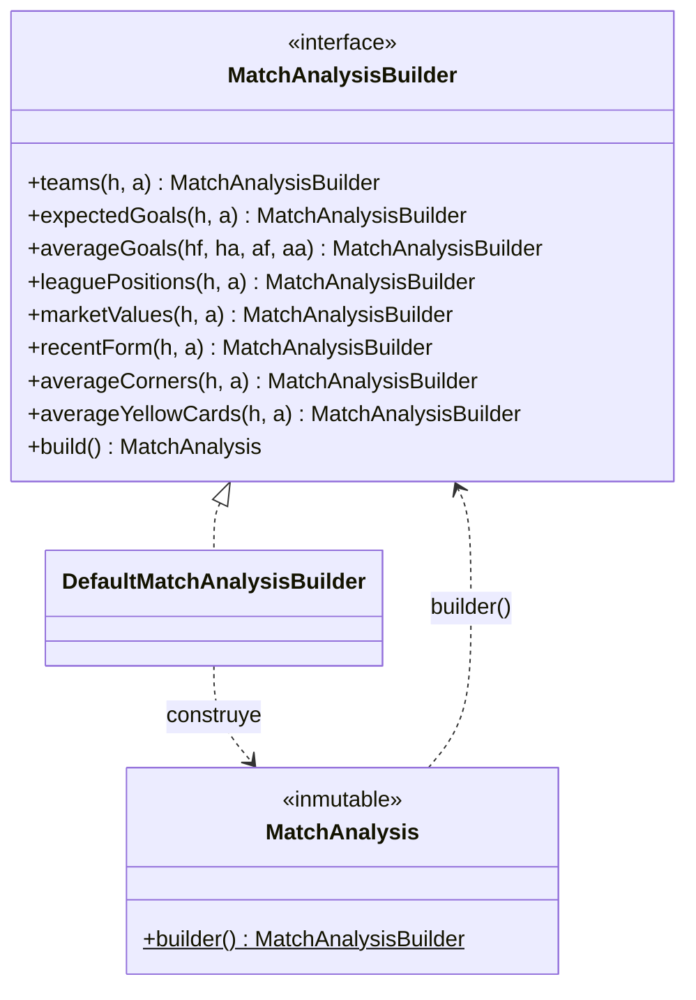
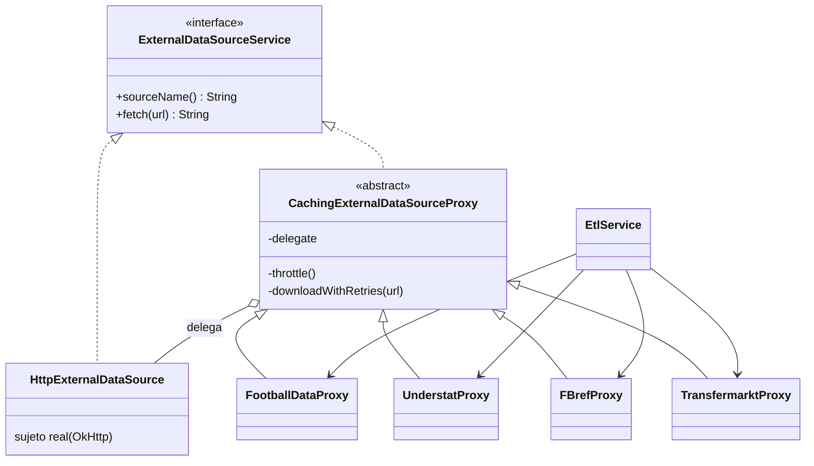
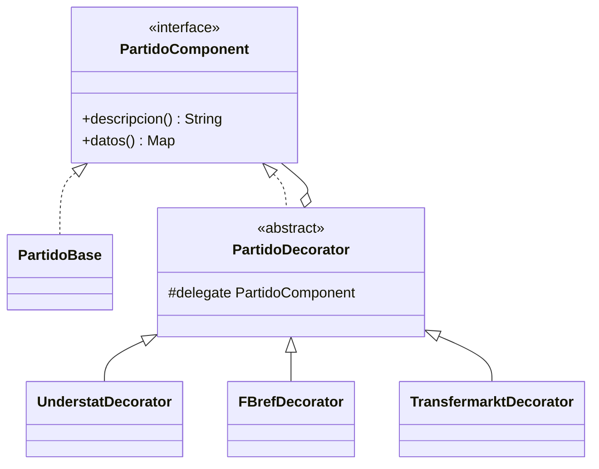

# LigaLytics — Documento técnico

Sistema de predicción de resultados y estadísticas de LaLiga aplicando patrones de software e inteligencia artificial.
Backend Java 17 + Spring Boot, base de datos PostgreSQL, frontend React + Vite, módulo de IA con Weka.

> Los diagramas están en [Mermaid](https://mermaid.js.org/): se ven directamente en GitHub y en VS Code (extensión
> «Markdown Preview Mermaid Support»). Para la presentación se pueden exportar a imagen desde <https://mermaid.live>.

---

## 1. Arquitectura general

Flujo: **fuentes → ETL (Proxy) → PostgreSQL → Observer (reentrena IA, actualiza estadísticas, invalida caché) →
Facade → API REST → React**.

### Capas del backend (`com.ligalytics`)

| Paquete | Responsabilidad |
|---|---|
| `controller` | API REST (`/teams`, `/ranking`, `/predict`, `/seasons`, `/model/report`, `/admin/**`) |
| `patterns.facade` | `LigaLyticsFacade`: única puerta de entrada de los controladores |
| `patterns.*` | Los 8 patrones (ver sección 3) |
| `etl` | Parsers (CSV/HTML), normalización de nombres, ingesta, carga automática |
| `ai` | Features sin fuga de datos, entrenamiento, validación y persistencia de modelos |
| `service` | Heap de clasificación, utilidades de temporada, caché, registro de predicciones |
| `repository` / `model` | Spring Data JPA + entidades |

---

## 2. Modelo de datos (PostgreSQL)

Las tablas las crea Hibernate (`spring.jpa.hibernate.ddl-auto=update`). La temporada de un partido no se guarda: se
deriva de la fecha (`SeasonUtil`: de julio a junio).

---

## 3. Patrones de software

### 3.1 Singleton — conexión a la base de datos

`DatabaseConfig` declara un único `DataSource` (pool HikariCP) como `@Bean` de scope singleton; todos los
repositorios comparten esa instancia. Otros singletons de Spring con estado: `PredictionCache`, `WekaModelManager`,
`TrainingReportHolder`.

### 3.2 Observer — reacción a nuevos datos del ETL

Cuando el ETL termina de cargar una fuente, `ETLSubject` notifica a todos los observadores: recalculan las
estadísticas por temporada, invalidan la caché de predicciones y reentrenan la IA (en segundo plano y con *debounce*
para no entrenar seis veces al cargar seis temporadas).

### 3.3 Strategy — algoritmo según la estadística a predecir

| Predicción | Estrategia (con modelo entrenado) | Estrategia de respaldo |
|---|---|---|
| Resultado 1X2 | Regresión logística (`WekaStrategy` + Weka `Logistic`) | `LogisticRegressionStrategy` |
| Goles | `PoissonStrategy` (modelo estadístico) | — |
| Córneres y tarjetas | Árbol de regresión (`WekaStrategy` + Weka `REPTree`) | `DecisionTreeStrategy` |

### 3.4 Facade — API simple sobre un subsistema complejo

Los controladores REST solo hablan con `LigaLyticsFacade`, que orquesta repositorios, ETL, motor de IA, ranking y
caché. El frontend no conoce nada de eso.

### 3.5 Factory Method — el predictor correcto según la solicitud

`PredictorFactory.createPredictor(tipo)` devuelve `PredictorResultado`, `PredictorGoles`, `PredictorCorneres` o
`PredictorTarjetas` sin que el llamador conozca la clase concreta. `PredictionStrategyResolver` completa la fábrica
eligiendo la estrategia Weka si hay modelo entrenado.

### 3.6 Builder — `MatchAnalysis` con más de 15 variables

El partido analizado (equipos, xG, córneres, tarjetas, valor de plantilla, forma, posición, promedios de goles…) se
construye paso a paso y solo con los datos disponibles. Lo usan el ETL (para guardar partidos), el entrenamiento y la
predicción.

### 3.7 Proxy — acceso controlado a las fuentes externas

El ETL nunca descarga directamente: cada fuente tiene su proxy, que añade **caché en disco** (TTL 24 h),
**control de frecuencia** (separación mínima entre peticiones, `ligalytics.etl.min-request-interval`) y
**reintentos** (hasta 3, con espera creciente).

### 3.8 Decorator — enriquecer el partido por capas

El historial de un equipo parte de `PartidoBase` (marcador) y lo envuelve con `UnderstatDecorator` (xG) y
`TransfermarktDecorator` (valor de plantilla). La descripción enriquecida aparece como información emergente en la
tabla «Últimos partidos» del perfil del equipo.

---

## 4. Módulo de inteligencia artificial

### 4.1 Variables de entrada (features)

Las calcula `TeamFormTracker`, que reproduce la liga partido a partido en orden cronológico. **Solo ve partidos
anteriores al que describe**, de modo que el entrenamiento no tiene fuga de información del futuro (hay un test que
lo comprueba: `MatchDatasetConverterTest.futureResultDoesNotChangeEarlierFeatures`).

| Variable | Fuente | Cómo se calcula |
|---|---|---|
| Promedio de goles a favor / en contra (local y visitante) | football-data | Últimos 10 partidos del equipo |
| xG acumulado de la temporada | Understat | Media del xG de la temporada en curso |
| Posición en la tabla | Calculada | `StandingsHeap` (heap) sobre la tabla de la temporada |
| Forma reciente | football-data | Últimos 5 resultados (G/E/P) |
| Valor de mercado de la plantilla | Transfermarkt | Valor guardado en `teams.market_value` |
| Córneres por partido | football-data | Promedio de los últimos 10 partidos del equipo |
| Tarjetas amarillas y rojas | football-data | Promedio propio por partido (últimos 10) |

Los promedios se *encogen* hacia la media de la liga cuando hay pocos partidos (inicio de temporada).

### 4.2 Modelos

* **Resultado (1X2):** regresión logística de Weka. Devuelve las tres probabilidades.
* **Goles:** distribución de Poisson. λ de cada equipo = (ataque propio + defensa rival) / 2 × ventaja de campo de la
  liga, mezclada con el xG si existe. Se publica el marcador más probable y P(+2.5).
* **Córneres y tarjetas:** árbol de regresión (REPTree) sobre el total del partido. Las tarjetas se reparten en
  amarillas y rojas de cada equipo según la proporción histórica.

### 4.3 Validación

* **Entrenamiento:** temporadas 2018-19 a 2022-23. **Prueba:** temporada 2023-24 (`ligalytics.ai.test-season-start-year`).
* **Métricas:** *accuracy* para el resultado; *error absoluto medio (MAE)* para goles, córneres y tarjetas.
* Cada métrica se compara con un **modelo trivial** (clase mayoritaria / media del entrenamiento) para saber si la IA
  realmente aporta.
* Tras medir, los modelos que se guardan se reentrenan con **todos** los partidos.
* Si no hay datos suficientes para separar entrenamiento y prueba se usa validación cruzada.
* El informe queda en `GET /api/model/report`, se muestra en el Inicio y en el panel de administración y se guarda en
  `backend/models/training-report.json`.

> Las cifras reales (accuracy, MAE) salen del entrenamiento sobre los datos descargados: consúltalas en la aplicación
> tras la primera carga. No se incluyen aquí valores inventados.

---

## 5. API REST (Swagger en `/api/swagger-ui.html`)

| Método | Ruta | Descripción |
|---|---|---|
| GET | `/api/teams?q=` | Equipos de la temporada más reciente (los 20), con búsqueda |
| GET | `/api/teams/{id}/stats?season=` | Estadísticas, forma e historial de un equipo |
| GET | `/api/ranking?season=` | Clasificación (ordenada con un heap) |
| GET | `/api/seasons` | Temporadas con datos |
| POST | `/api/predict` | Predicción de un partido (`homeTeamId`, `awayTeamId`) |
| GET | `/api/predict/history` | Últimas 20 predicciones guardadas |
| GET | `/api/model/report` | Métricas de validación del modelo |
| POST | `/api/admin/etl/football-data` | Cargar partidos (6 temporadas por defecto) |
| POST | `/api/admin/etl/understat` | Cargar xG |
| POST | `/api/admin/etl/transfermarkt` | Cargar valores de plantilla |
| POST | `/api/admin/etl/fbref` | Cargar calendario de FBref |
| POST | `/api/admin/train` | Reentrenar y validar la IA |
| GET | `/api/admin/status` | Equipos, partidos y rango de fechas cargados |

Con `ADMIN_API_KEY` definida, las rutas `/admin/**` exigen la cabecera `X-Admin-Key`.

---

## 6. Despliegue en producción

| Componente | Plataforma | Configuración |
|---|---|---|
| Frontend React | Vercel | `frontend/vercel.json`; variable `VITE_API_BASE_URL=https://<backend>.up.railway.app/api` |
| Backend Spring Boot | Railway (Docker) | `backend/Dockerfile` + `backend/railway.json`; health check `/api/health` |
| PostgreSQL | Railway (plugin) | Variables del backend: ver abajo |
| CI/CD | GitHub Actions | `.github/workflows/ci.yml`: pruebas en cada push/PR y despliegue en cada push a `main` |

Variables de entorno del servicio backend en Railway:

| Variable | Valor |
|---|---|
| `DB_URL` | `jdbc:postgresql://${{Postgres.PGHOST}}:${{Postgres.PGPORT}}/${{Postgres.PGDATABASE}}` |
| `DB_USERNAME` | `${{Postgres.PGUSER}}` |
| `DB_PASSWORD` | `${{Postgres.PGPASSWORD}}` |
| `CORS_ALLOWED_ORIGINS` | URL pública de Vercel (varias separadas por coma) |
| `ADMIN_API_KEY` | Una clave larga para proteger `/admin/**` |
| `AUTO_LOAD_DATA` | `true` (por defecto): al arrancar con la BD vacía descarga los datos reales y entrena |

Secretos de GitHub para el despliegue automático: `RAILWAY_TOKEN`, `RAILWAY_SERVICE`, `VERCEL_TOKEN`,
`VERCEL_ORG_ID`, `VERCEL_PROJECT_ID`. Si faltan, el paso se omite con un aviso.

---

## 7. Verificación de requisitos

| Requisito de la propuesta | Dónde se cumple |
|---|---|
| Backend 100 % Java 17 + Spring Boot | `backend/` |
| Frontend React | `frontend/` (React + Vite + TypeScript) |
| Base de datos PostgreSQL | JPA + `DatabaseConfig` (Singleton) |
| 5 patrones obligatorios | Singleton, Observer, Strategy, Facade, Factory Method (sección 3.1 a 3.5) |
| 3 patrones adicionales | Builder, Proxy, Decorator (3.6 a 3.8) |
| IA con Weka | `ai/`: regresión logística y REPTree (+ Poisson) |
| Validación 2018-2023 / 2023-24, accuracy y MAE | `WekaTrainingService`, `/api/model/report` |
| Datos reales ≥ 5 temporadas | Carga automática de 6 temporadas de football-data (2018-19 a 2023-24) |
| Buscador con autocompletado | `TeamSearch` (pantalla Equipos) |
| Predicción de partido | Pantalla Predicciones (probabilidades, marcador, córneres, tarjetas) |
| Perfil de equipo | Modal del equipo: historial, forma, medias |
| Ranking | Pantalla Clasificación (por temporada, ordenada con un heap) |
| Panel de administración | Pantalla Administración (forzar ETL, reentrenar, ver métricas) |
| API documentada con Swagger | `/api/swagger-ui.html` |
| Despliegue en la nube + CI/CD | Sección 6 |

---

## 8. Ganador con modelo externo (Football Charts)

La predicción de ganador (1X2) usa, cuando existe, el modelo Dixon-Coles de Football Charts a través de una
`FootballChartsStrategy` (patrón Strategy). `PredictionStrategyResolver.resolveExternalResultStrategy` la elige si el
cliente (`FootballChartsClient`, con caché de 30 minutos) tiene el partido; si no, se usa el modelo propio (regresión
logística de Weka). La respuesta indica `winnerSource` (`football-charts` o `modelo-propio`) y las probabilidades del
modelo propio, y cada predicción se guarda en la tabla `predictions` con su fuente para poder medir después cuál acierta
más. Goles, córneres y tarjetas siguen siendo del modelo propio. La API no ofrece probabilidades de partidos ya jugados,
por lo que su acierto histórico no puede verificarse hacia atrás.

### Marcador y goles coherentes con el ganador

El total de goles esperado `T` se calcula con la forma reciente de ambos equipos, su nivel a largo plazo, la localía y los
últimos 5 enfrentamientos directos (pesan un 20 % si hay al menos 3); si el modelo externo aporta sus goles esperados, se
promedian. `ScoreDistribution` reparte `T` entre local y visitante de modo que la matriz de Poisson cumpla
`P(local) − P(visitante)` igual al del ganador previsto. De esa matriz salen los goles esperados de cada equipo, el marcador
más probable entre los que cumplen el ganador, el top 5 de marcadores, P(más de 2,5) y P(ambos marcan), todo coherente.
El endpoint `GET /api/teams/h2h?homeId=&awayId=` devuelve los últimos enfrentamientos con un resumen.

---

## 9. Módulo de apuestas (demo con dinero ficticio)

**Alcance.** Simulador educativo: no hay dinero real, pagos ni conexión con casas de apuestas. Sustituye la nota
inicial de la propuesta ("no es una herramienta de apuestas") por "simulador educativo con dinero ficticio".

**Cuentas** (`auth/`). `POST /api/auth/register|login|logout`, `GET /api/auth/me`. Contraseñas con PBKDF2-HMAC-SHA256
(210 000 iteraciones, sal aleatoria); el token de sesión es opaco, caduca a los 7 días y solo se guarda su hash SHA-256.
`AuthInterceptor` protege `/api/betting/**`. Bloqueo de 5 min tras 5 intentos fallidos. Cada cuenta nueva recibe
**100 000 COP ficticios** (`/api/betting/wallet/reset` los restablece). Sin verificación de correo ni recuperación.

**Cuotas** (`betting/`). `BzzoiroOddsProvider` obtiene el consenso de ~14 casas (1X2, más/menos, ambos marcan,
córneres) con caché de 30 min. No existe fuente gratuita verificada de cuotas de tarjetas: `MarketModel.demoCardOdds`
genera cuotas "demo" (margen 7 %) etiquetadas como tales.

**Probabilidades del modelo** (`MarketModel`): ganador de la predicción (Football Charts o modelo propio); goles y ambos
marcan de `ScoreDistribution`; córneres y tarjetas con aproximación normal sobre el total esperado (σ = 3,4 y 2,5).

**Recomendaciones.** `ventaja = p × cuota − 1`. Como el modelo no está demostrado frente al mercado, la probabilidad se
ancla a la del mercado sin margen y se descartan ventajas fuera de 3–25 %, discrepancias modelo/mercado > 15 puntos,
p < 30 % y cuotas demo. Importe sugerido: ¼ de Kelly con tope del 5 % del saldo.

**Apuestas.** La cuota la fija el servidor, el partido no debe haber empezado y el importe debe caber en el saldo
(bloqueo pesimista de la fila del usuario). `BetSettlementObserver` (Observer) y una tarea cada 30 min liquidan
ganador, goles, ambos marcan, córneres y tarjetas; sin datos suficientes la apuesta queda pendiente.
